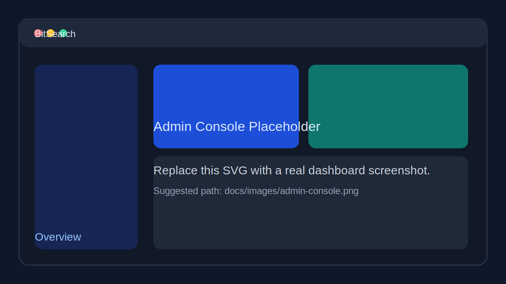
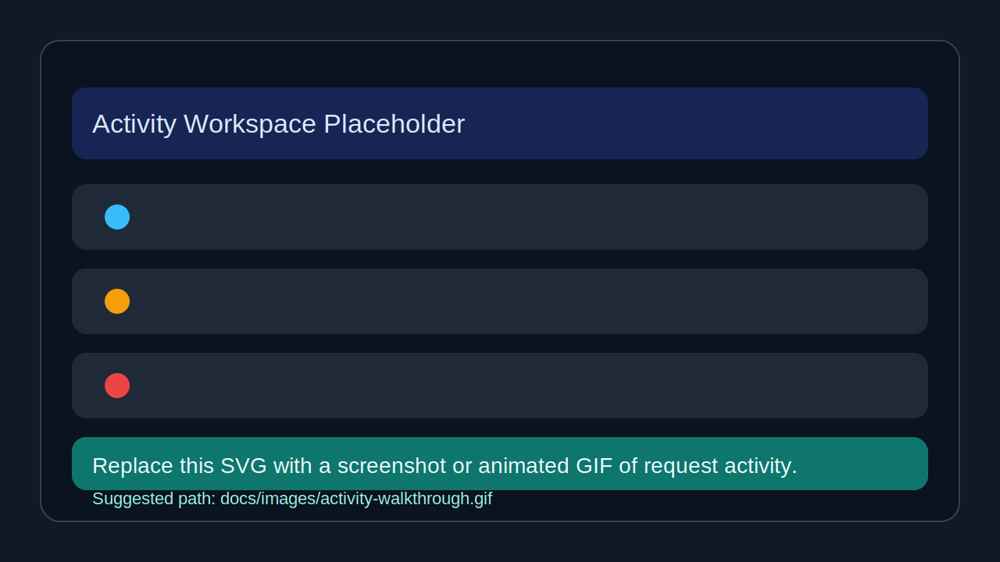

# BitSearch

Self-hosted MCP search gateway and admin console for personal use, with controllable web retrieval, key-pool failover, and observable search traffic.

<p>
  <a href="LICENSE"></a>
  <a href="https://www.typescriptlang.org/"></a>
  <a href="https://nodejs.org/"></a>
  <a href="Dockerfile"></a>
  <a href=".github/workflows/docker-publish.yml"></a>
  <a href="DEPLOYMENT.md"></a>
  <a href="#roadmap"></a>
</p>

## About

BitSearch packages two things into one deployable service: an HTTP-based Model Context Protocol server and a browser-based admin console. It is designed for individual users who want a single, self-hosted entrypoint for web search, fetch, and site-mapping workflows without giving up control over provider credentials, routing order, or request visibility.

The backend exposes `13` MCP tools over streamable HTTP, routes fetch-like operations across Tavily and Firecrawl key pools, and persists telemetry in SQLite. The frontend gives a single user one workspace for provider configuration, key imports, quota sync, MCP access details, dashboards, and request activity inspection. BitSearch does not implement team-facing collaboration or multi-user workspace features.

### Highlights

- Exposes `13` MCP tools across search, configuration, and planning workflows.
- Supports multi-provider routing with ordered failover for Tavily and Firecrawl operations.
- Manages provider key pools with bulk import, enable/disable controls, testing, notes, quota sync, and CSV export.
- Includes a six-phase query planning engine for structured search execution.
- Tracks request logs, per-attempt failures, dashboard metrics, and recent errors in a built-in admin console.
- Supports two deployment paths: npm-based source deployment and Docker container deployment.

## Built With

- [TypeScript](https://www.typescriptlang.org/)
- [Node.js](https://nodejs.org/)
- [Express](https://expressjs.com/)
- [React](https://react.dev/)
- [Vite](https://vitejs.dev/)
- [Zod](https://zod.dev/)
- [Model Context Protocol SDK](https://github.com/modelcontextprotocol/typescript-sdk)
- SQLite (`node:sqlite`)
- Docker and Docker Compose

## Getting Started

### Prerequisites

| Mode | Requirement |
|------|-------------|
| npm deployment | Node.js `22+`, npm `10+` |
| Docker deployment | Docker `24+`, Docker Compose v2 |

### Installation

Shell examples below use `bash`. A PowerShell alternative is shown where the command differs.

1. Clone the repository and install dependencies.

```bash
git clone <your-repo-url>
cd bitsearch
npm ci
```

2. Copy the example environment file.

```bash
cp .env.example .env
```

```powershell
Copy-Item .env.example .env
```

3. Fill in the required production values.

Required in production:

- `APP_ENCRYPTION_KEY`
- `ADMIN_AUTH_KEY`
- `SESSION_SECRET`
- `MCP_BEARER_TOKEN`

Common runtime settings:

- `APP_PORT` defaults to `8097`
- `APP_HOST` defaults to `0.0.0.0`
- `TRUST_PROXY=true` is required when a reverse proxy terminates TLS
- `DATABASE_PATH` controls the SQLite file path
- `BITSEARCH_IMAGE` is reserved for a future published container image and should remain a placeholder for now

4. Generate random secrets when needed.

```bash
node -e "console.log(require('crypto').randomBytes(32).toString('hex'))"
```

5. If you plan to use npm deployment, create the local data directory.

```bash
mkdir -p data
```

```powershell
New-Item -ItemType Directory -Force data | Out-Null
```

> Docker Compose reads `.env` automatically. npm deployment does not; export the variables from `.env` into your shell before starting the server.

### Quick Start

#### Option 1: npm deployment

```bash
npm run build
set -a
source .env
set +a
bash scripts/start.sh
```

This starts the production server from local source and serves the built admin UI from the same process.

#### Option 2: Docker deployment

Build and run the local container image with Docker Compose:

```bash
docker compose up -d --build
```

Useful commands:

```bash
docker compose logs -f
docker compose down
```

Future published image placeholder:

```bash
# Example only. The image is not published yet.
# BITSEARCH_IMAGE=docker.io/your-dockerhub-namespace/bitsearch:latest
docker compose -f docker-compose.image.yml up -d
```

Useful endpoints after either deployment mode starts:

- App and admin console: `http://127.0.0.1:8097`
- Health check: `http://127.0.0.1:8097/healthz`
- MCP endpoint: `http://127.0.0.1:8097/mcp`

For full deployment options, see [DEPLOYMENT.md](DEPLOYMENT.md).

## Usage

### 1. Verify the service is running

```bash
curl http://127.0.0.1:8097/healthz
```

Expected response:

```json
{"ok":true}
```

### 2. Connect an MCP client

Example streamable HTTP client configuration. The exact field names vary by client, but the endpoint and bearer token are the important parts:

```json
{
  "mcpServers": {
    "bitsearch": {
      "type": "streamable-http",
      "url": "http://127.0.0.1:8097/mcp",
      "headers": {
        "Authorization": "Bearer <MCP_BEARER_TOKEN>"
      }
    }
  }
}
```

### 3. Operate the admin console

1. Start the app with one of the deployment modes above.
2. Open `http://127.0.0.1:8097`.
3. Sign in with `ADMIN_AUTH_KEY`.
4. Configure provider base URLs, import Tavily / Firecrawl keys, and review the MCP access panel.
5. Use the Overview, Providers, Keys, and Activity workspaces to monitor routing behavior and failures.

### Screenshots / GIF Placeholders

`README` image paths are wired now so the placeholders can be replaced with real product captures later.





## Roadmap

- Add more provider adapters and per-tool routing policies.
- Increase automated coverage for MCP transport, failover logic, and admin flows.
- Publish an official Docker image and swap placeholder badges for live ones.
- Expand dashboard analytics and operational audit views.

## Contributing

See [CONTRIBUTING.md](CONTRIBUTING.md) for issue reporting, pull request flow, coding standards, and verification requirements.

## License

Distributed under the MIT License. See [LICENSE](LICENSE) for the full text.
