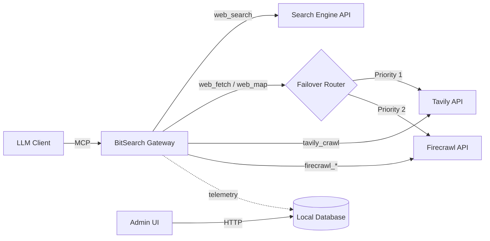

# BitSearch

Self-hosted MCP search gateway and admin console for personal use, combining AI search, targeted crawling, and multi-round verification to reduce retrieval hallucinations.

<p>
  <a href="LICENSE"></a>
  <a href="https://www.typescriptlang.org/"></a>
  <a href="https://nodejs.org/"></a>
  <a href="Dockerfile"></a>
  <a href="https://github.com/Hedeoer/bitsearch/actions/workflows/docker-publish.yml"></a>
  <a href="https://hub.docker.com/r/hedeoerwang/bitsearch"></a>
  <a href="https://github.com/Hedeoer/bitsearch"></a>
</p>

## About

BitSearch packages two things into one deployable service: an HTTP-based Model Context Protocol server and a browser-based admin console. It is designed for individual users who want a single, self-hosted entrypoint for web search, fetch, and site-mapping workflows without giving up control over provider credentials, routing order, or request visibility.

Its core differentiator is not just exposing search and crawl tools, but combining the strengths of a search-engine model with Tavily and Firecrawl into a more disciplined retrieval loop: use the search engine to plan and search broadly, use Tavily / Firecrawl to fetch or crawl the most relevant targets, then cross-check evidence across multiple rounds before presenting conclusions. This makes BitSearch especially suitable for workflows that need better grounding and lower hallucination risk than one-shot search or one-shot crawling alone.

The backend exposes `20` MCP tools over streamable HTTP, routes generic fetch-like operations across Tavily and Firecrawl key pools, and also exposes provider-specific crawl / batch / extract tools for advanced workflows. It persists telemetry in SQLite. The frontend gives a single user one workspace for provider configuration, key imports, quota sync, MCP access details, dashboards, and request activity inspection. BitSearch does not implement team-facing collaboration or multi-user workspace features.

Project endpoints:

- GitHub: `https://github.com/Hedeoer/bitsearch`
- Docker Hub image: `docker.io/hedeoerwang/bitsearch`

### Highlights

- Exposes `20` MCP tools across search, provider-specific web extraction, configuration, and planning workflows.
- Combines `search_engine`, Tavily, and Firecrawl into a planned multi-round search, crawl, and verification workflow instead of treating them as isolated tools.
- Uses broad search plus targeted fetch/crawl plus source cross-checking to reduce misinformation and retrieval hallucinations.
- Supports multi-provider routing with ordered failover for Tavily and Firecrawl operations.
- Manages provider key pools with bulk import, enable/disable controls, testing, notes, quota sync, and CSV export.
- Includes a six-phase query planning engine for structured search execution.
- Tracks request logs, per-attempt failures, dashboard metrics, and recent errors in a built-in admin console.
- Supports two deployment paths: npm-based source deployment and Docker container deployment.

### Architecture



### Why BitSearch

- Use a search-engine model for broad discovery and planning, then hand off to Tavily and Firecrawl for targeted fetch, crawl, and extraction.
- Validate across multiple rounds instead of trusting a single search pass or a single crawl result.
- Keep the whole retrieval loop observable through one admin console for keys, routing, quotas, request logs, and failures.

## Quick Start

### Docker (Recommended)

```bash
cp .env.example .env
docker compose up -d
docker exec -it bitsearch node -e "console.log(JSON.parse(require('fs').readFileSync('/app/data/runtime-secrets.json','utf8')).secrets.adminAuthKey)"
```

- Admin Console: `http://127.0.0.1:8097`
- MCP endpoint: `http://127.0.0.1:8097/mcp`

### Native

```bash
npm ci
npm run build
set -a
source .env
set +a
bash scripts/start.sh
```

### Connect a Client

Use the MCP endpoint with a Bearer token:

```text
URL: http://127.0.0.1:8097/mcp
Authorization: Bearer <MCP_BEARER_TOKEN>
```

Detailed setup, reverse proxy examples, and long-form reference material are kept below.

## Installation & Detailed Setup

### Prerequisites

| Mode | Requirement |
|------|-------------|
| npm deployment | Node.js `22+`, npm `10+` |
| Docker deployment | Docker `24+`, Docker Compose v2 |

### Installation

Shell examples below use `bash`. A PowerShell alternative is shown where the command differs.

1. Clone the repository and install dependencies.

```bash
git clone https://github.com/Hedeoer/bitsearch.git
cd bitsearch
npm ci
```

2. Copy the example environment file.

```bash
cp .env.example .env
```

```powershell
Copy-Item .env.example .env
```

3. Configure secrets (optional).

BitSearch supports a low-ops default: if you leave the secret env vars empty, it
generates them on first boot and persists them to `data/runtime-secrets.json`
(next to your SQLite DB). You can still override any value via environment
variables.

If you prefer to manage secrets externally, set these explicitly:

- `APP_ENCRYPTION_KEY` (must remain stable or stored secrets become unreadable)
- `ADMIN_AUTH_KEY` (admin console login key)
- `SESSION_SECRET` (admin session cookie signing secret)
- `MCP_BEARER_TOKEN` (MCP `/mcp` bearer token)

4. Generate random secrets when needed.

```bash
node -e "console.log(require('crypto').randomBytes(32).toString('hex'))"
```

5. If you plan to use npm deployment, create the local data directory.

```bash
mkdir -p data
```

```powershell
New-Item -ItemType Directory -Force data | Out-Null
```

If you let BitSearch auto-generate secrets, start the app once and then read the
admin login key from the persisted runtime secrets file:

```bash
cat data/runtime-secrets.json
```

For Docker:

```bash
docker exec -it bitsearch cat /app/data/runtime-secrets.json
```

If you only need the generated admin console login key, read the `adminAuthKey`
field directly:

```bash
node -e "console.log(JSON.parse(require('fs').readFileSync('data/runtime-secrets.json','utf8')).secrets.adminAuthKey)"
```

For Docker:

```bash
docker exec -it bitsearch node -e "console.log(JSON.parse(require('fs').readFileSync('/app/data/runtime-secrets.json','utf8')).secrets.adminAuthKey)"
```

> Docker Compose reads `.env` automatically. npm deployment does not; export the variables from `.env` into your shell before starting the server.

### Deployment Paths

#### Option 1: npm deployment

```bash
npm run build
set -a
source .env
set +a
bash scripts/start.sh
```

This starts the production server from local source and serves the built admin UI from the same process.

#### Option 2: Docker deployment

The default Docker path uses one file only:

| File | Used for | Notes |
|------|----------|-------|
| `.env` | Runtime configuration | Copy from `.env.example`. Secrets can be left empty and will be generated + persisted on first boot |
| `docker-compose.yml` | Run the published image | Pulls `BITSEARCH_IMAGE` directly and already includes restart policy, log rotation, and healthcheck |

Container runtime variables:

| Variable | Required | Default / Example | Purpose |
|----------|----------|-------------------|---------|
| `APP_PORT` | No | `8097` | Container port exposed on the host |
| `APP_HOST` | No | `0.0.0.0` | Bind address inside the container |
| `TRUST_PROXY` | No | `false` | Set to `true` when running behind Nginx, Caddy, Traefik, or another reverse proxy |
| `DATABASE_PATH` | No | `/app/data/bitsearch.db` | SQLite file path inside the container; compose already points it to the mounted volume |
| `RUNTIME_SECRETS_FILE` | No | `/app/data/runtime-secrets.json` | Optional override for the persisted runtime secrets file path |
| `APP_ENCRYPTION_KEY` | No (auto) | random 32-byte hex string | Encrypts stored provider credentials (must remain stable) |
| `ADMIN_AUTH_KEY` | No (auto) | custom bearer token | Used to sign in to the admin console |
| `SESSION_SECRET` | No (auto) | random 32-byte hex string | Signs the admin session cookie |
| `MCP_BEARER_TOKEN` | No (auto) | custom bearer token | Required by MCP clients calling `/mcp` |
| `BITSEARCH_IMAGE` | No | `docker.io/hedeoerwang/bitsearch:latest` | Image reference used by `docker-compose.yml` |
| `NODE_ENV` | No | `production` | Already set by the compose files; normally no manual change is needed |

Recommended Docker start:

```bash
cp .env.example .env
# edit .env
docker compose up -d
```

If you want to pin a different published tag, change `BITSEARCH_IMAGE` in `.env`
instead of using alternate compose files.

Common Docker commands:

```bash
docker compose logs -f
docker compose down
docker compose pull
docker compose up -d
```

The GitHub Actions Docker publish workflow pushes:

- `latest` and `main` on successful pushes to `main`
- `sha-*` tags for traceability
- semantic version tags when you push tags matching `v*.*.*`

#### Option 3: Development mode
For day-to-day local development, use the Vite frontend as the fixed browser entrypoint and let it proxy API traffic to the TSX backend:
```bash
# Starts the Express server on 127.0.0.1:8097 and the Vite dev server on 5173
npm run dev
```
- Admin Console: `http://localhost:5173`
- Backend API/MCP (dev service): `http://127.0.0.1:8097`

Useful dev endpoints:

- Browser entrypoint: `http://localhost:5173`
- Health check: `http://127.0.0.1:8097/healthz`
- MCP endpoint: `http://127.0.0.1:8097/mcp`

For local development, prefer `http://localhost:5173` for browser verification. Temporary standalone ports are for isolated debugging only and should not be treated as the default dev entrypoint.

### Reverse Proxy Example (Nginx)

For production deployments behind Nginx, set `TRUST_PROXY=true` in `.env` so BitSearch can derive the correct external protocol and host for the Admin Console and MCP access panel.

It is recommended to expose BitSearch at the site root of a dedicated domain such as `https://bitsearch.example.com`, because the frontend router and backend endpoints use root-based paths like `/`, `/api/admin`, and `/mcp`.

The full Nginx example below includes the MCP-specific proxy settings that were required to make `notifications/initialized` and other Streamable HTTP requests work reliably behind reverse proxying.

<details>
<summary>Expand the full Nginx reverse proxy example</summary>

```nginx
upstream bitsearch_backend {
    server 127.0.0.1:8097;
    keepalive 32;
}

log_format bitsearch_mcp '$remote_addr - $remote_user [$time_local] '
                         '"$request" $status $body_bytes_sent '
                         'upstream_status="$upstream_status" '
                         'upstream_response_time="$upstream_response_time" '
                         'sid="$http_mcp_session_id" '
                         'proto="$http_mcp_protocol_version" '
                         'origin="$http_origin" '
                         'accept="$http_accept" '
                         'ua="$http_user_agent"';

server {
    listen 80;
    server_name bitsearch.example.com;
    return 301 https://$host$request_uri;
}

server {
    listen 443 ssl http2;
    server_name bitsearch.example.com;

    ssl_certificate     /etc/letsencrypt/live/bitsearch.example.com/fullchain.pem;
    ssl_certificate_key /etc/letsencrypt/live/bitsearch.example.com/privkey.pem;

    access_log /var/log/nginx/bitsearch_access.log;
    error_log  /var/log/nginx/bitsearch_error.log warn;

    location = /mcp {
        access_log /var/log/nginx/bitsearch_mcp_access.log bitsearch_mcp;

        proxy_pass http://bitsearch_backend;
        proxy_http_version 1.1;

        proxy_set_header Host $host;
        proxy_set_header X-Real-IP $remote_addr;
        proxy_set_header X-Forwarded-For $proxy_add_x_forwarded_for;
        proxy_set_header X-Forwarded-Proto $scheme;
        proxy_set_header X-Forwarded-Host $host;
        proxy_set_header Connection "";

        proxy_request_buffering off;
        proxy_buffering off;
        proxy_intercept_errors off;
        proxy_pass_request_headers on;

        proxy_pass_header Mcp-Session-Id;
        proxy_pass_header Content-Type;
        proxy_pass_header Cache-Control;

        chunked_transfer_encoding off;
        proxy_read_timeout 3600s;
        proxy_send_timeout 3600s;
    }

    location / {
        proxy_pass http://bitsearch_backend;
        proxy_http_version 1.1;

        proxy_set_header Host $host;
        proxy_set_header X-Real-IP $remote_addr;
        proxy_set_header X-Forwarded-For $proxy_add_x_forwarded_for;
        proxy_set_header X-Forwarded-Proto $scheme;
        proxy_set_header X-Forwarded-Host $host;
    }
}
```

</details>

For full deployment options, see [DEPLOYMENT.md](DEPLOYMENT.md).

## Usage

### 1. Verify the service is running

```bash
curl http://127.0.0.1:8097/healthz
```

Expected response:

```json
{"ok":true}
```

### 2. Connect an MCP client

Example streamable HTTP client configuration. The exact field names vary by client, but the endpoint and bearer token are the important parts:

```json
{
  "mcpServers": {
    "bitsearch": {
      "type": "streamable-http",
      "url": "http://127.0.0.1:8097/mcp",
      "headers": {
        "Authorization": "Bearer <MCP_BEARER_TOKEN>"
      }
    }
  }
}
```

If BitSearch is deployed behind a reverse proxy, replace the local URL with the public MCP endpoint, for example `https://bitsearch.example.com/mcp`.

#### Claude Code

Claude Code should connect to BitSearch as a remote HTTP MCP server:

```bash
claude mcp add --scope user --transport http bitsearch https://bitsearch.example.com/mcp \
  --header "Authorization: Bearer <MCP_BEARER_TOKEN>"
```

If you prefer a project-local config, you can also place a matching entry in `.mcp.json`:

```json
{
  "mcpServers": {
    "bitsearch": {
      "type": "http",
      "url": "https://bitsearch.example.com/mcp",
      "headers": {
        "Authorization": "Bearer ${BITSEARCH_MCP_TOKEN}"
      }
    }
  }
}
```

Export the token in the shell before launching Claude Code:

```bash
export BITSEARCH_MCP_TOKEN="<MCP_BEARER_TOKEN>"
```

#### Codex

Codex should connect to BitSearch as a remote streamable HTTP MCP server:

```bash
export BITSEARCH_MCP_TOKEN="<MCP_BEARER_TOKEN>"

codex mcp add bitsearch \
  --url https://bitsearch.example.com/mcp \
  --bearer-token-env-var BITSEARCH_MCP_TOKEN
```

Equivalent `~/.codex/config.toml` entry:

```toml
[mcp_servers.bitsearch]
url = "https://bitsearch.example.com/mcp"
bearer_token_env_var = "BITSEARCH_MCP_TOKEN"
```

#### Agent Skills-Compatible Clients

If your client supports the open Agent Skills standard, prefer `skill + mcp` over copying the long BitSearch companion prompt into every session.

This repository ships one standard BitSearch skill template in `skills/bitsearch-research/`. It merges routing rules, evidence rules, retrieval workflow, and Planning Engine escalation into one coherent skill that can be reused across Agent Skills-compatible clients.

Recommended installation:

```bash
mkdir -p .agents/skills
cp -R skills/bitsearch-research .agents/skills/
```

User-wide install:

```bash
mkdir -p ~/.agents/skills
cp -R skills/bitsearch-research ~/.agents/skills/
```

If your client does not scan `.agents/skills/`, copy the same folder into its native skills directory instead, such as `.claude/skills/`, `~/.claude/skills/`, or `~/.codex/skills/`.

See [skills/README.md](skills/README.md) and [llmdoc/guides/using-bitsearch-with-agent-skills.md](llmdoc/guides/using-bitsearch-with-agent-skills.md) for the standard template structure, compatibility notes, and the local snapshot of the Agent Skills specification.

#### Disable Native Web Tools When Using BitSearch

Some clients ship with built-in web tools such as `WebSearch` or `WebFetch`. Even if BitSearch MCP and the `bitsearch-research` skill are installed, the client may still prefer its own native web tools unless you disable them locally. If that happens, BitSearch cannot enforce its routing, evidence, or Planning Engine behavior.

Important constraints:

- Disable native web tools in the client itself. BitSearch cannot do this remotely.
- The `toggle_builtin_tools` MCP tool is only a stub for remote deployments and always returns an error instead of changing local client settings.

##### Claude Code

For a one-off session, deny the built-in web tools on the command line:

```bash
claude --disallowedTools WebSearch WebFetch
```

For persistent configuration, add a deny rule in Claude Code settings. You can place this in `~/.claude/settings.json`, `.claude/settings.json`, or `.claude/settings.local.json`:

```json
{
  "permissions": {
    "deny": ["WebSearch", "WebFetch"]
  }
}
```

##### Codex

Current Codex CLI help documents native live web search via the `--search` flag. When using BitSearch, do not launch Codex with `--search`, and remove that flag from any shell alias, wrapper script, launcher, or profile that adds it automatically.

Minimal BitSearch-oriented launch examples:

```bash
codex
```

```bash
codex -C /path/to/project
```

If you previously enabled native search in a wrapper or shortcut, remove `--search` there. In the current Codex CLI help, no separate documented native `WebFetch` toggle is exposed; the practical safeguard is to keep native search disabled so BitSearch remains the only web-capable path.

### 3. Operate the admin console

1. Start the app with one of the deployment modes above.
2. Open `http://127.0.0.1:8097`.
3. Sign in with `ADMIN_AUTH_KEY` (from `.env`, or from `data/runtime-secrets.json` if auto-generated; the exact JSON field is `secrets.adminAuthKey`).
4. Configure provider base URLs, import Tavily / Firecrawl keys, and review the Admin/MCP access panels.
5. Use the Overview, Providers, Keys, and Activity workspaces to monitor routing behavior and failures.

### 4. Configure providers

#### search_engine (OpenAI-compatible endpoint)

`search_engine` is the core search provider. Point it at any OpenAI-compatible chat completions service.

In the **Providers** workspace, set:

- **Base URL** — the root of the OpenAI-compatible API, e.g.:
  - OpenAI: `https://api.openai.com/v1`
  - Ollama (local): `http://localhost:11434/v1`
  - Any third-party relay: follow the provider's documentation
- **API Key** — the API key for the service (stored encrypted, never logged)
- **Model** — the model ID to use for search; can also be switched at runtime via the `switch_model` MCP tool
- **Timeout** — set to ≥ 120 000 ms; search completions take longer than regular chat requests
- **Probe models** — checks the staged `/models` endpoint response without saving changes
- **Run live test** — sends a real staged `chat/completions` request without saving changes so you can verify Base URL, API key, timeout, and model together

#### Tavily (key pool)

Tavily supplies extra sources for `web_search`, handles `web_fetch` / `web_map` failover requests, and powers the provider-specific `tavily_crawl` tool.

1. Get a key at <https://tavily.com> — the free tier includes 1 000 API calls/month.
2. Open the **Keys** workspace, select **Tavily**, paste one or more keys (one per line), and click **Import**.
3. Keys are deduplicated automatically. View health status and quota in the same workspace.
4. Base URL default: `https://api.tavily.com` — leave unchanged unless you use a proxy.

#### Firecrawl (key pool)

Firecrawl handles `web_fetch` (page scrape → Markdown), `web_map` (site URL graph), `web_search` extra sources, and the provider-specific async tools `firecrawl_crawl`, `firecrawl_batch_scrape`, and `firecrawl_extract`.

1. Get a key at <https://www.firecrawl.dev> — the free tier includes 500 credits/month.
2. Open the **Keys** workspace, select **Firecrawl**, paste the key, and click **Import**.
3. Base URL default: `https://api.firecrawl.dev/v2` — leave unchanged unless you use a proxy.

#### Generic retrieval routing

Set in the **Overview** workspace under **Generic Retrieval Routing**:

| Mode | Behavior |
|------|----------|
| `single_provider` | Uses one provider for `web_fetch`, `web_map`, and `web_search` extra sources |
| `ordered_failover` | Tries the primary provider first, then falls back to the second provider on failure or unusable keys |

Generic retrieval routing only affects `web_fetch`, `web_map`, and `web_search` extra sources. Provider-specific tools such as `tavily_crawl` and `firecrawl_*` always execute against their named provider and never fall back across providers.

### Screenshots


## FAQ & Troubleshooting

- **Q: MCP connection times out / fails?**
  A: Ensure `TRUST_PROXY=true` in your `.env` if exposing behind an NGinX/Caddy reverse proxy, and make sure `MCP_BEARER_TOKEN` matches your client config.
- **Q: MCP tools start failing after I changed provider/tool settings in BitSearch?**
  A: BitSearch may change the exposed MCP tool surface when routing or provider configuration changes. If your MCP client does not support MCP tool-change notifications, reload the MCP server configuration in the client, or start a fresh conversation/context so the client re-reads the current tool list.
- **Q: What happens when Tavily keys run out of quota?**
  A: The Failover Router will mark the exhausted key as invalid for a timeout period and rotate to the next active Tavily key. If no Tavily keys remain, it gracefully downgrades to Firecrawl.
- **Q: I lost my `APP_ENCRYPTION_KEY`. Can I recover my API keys?**
  A: No. Keys are stored encrypted (AES-256-GCM). Restore `data/runtime-secrets.json` (or set `APP_ENCRYPTION_KEY`) to regain access. If encrypted provider secrets exist and the key is missing, BitSearch refuses to start to avoid silently generating a new key. If you cannot recover the key, you must wipe the stored provider secrets and re-import them.

## Reference

### MCP Tools Reference

BitSearch exposes 20 tools to the LLM client, covering four main areas.

<details>
<summary>Expand the full MCP tools reference</summary>

#### 1. Search & Web Access
- **`web_search`**: Performs AI-driven web search using the configured search engine model. Caches sources server-side.
- **`get_sources`**: Retrieves source links cached during a `web_search` call using the returned `session_id`.
- **`web_fetch`**: Extracts full Markdown content from a target URL. Automatically fails over across Tavily and Firecrawl key pools.
- **`web_map`**: Maps website structure and discovers URLs using Tavily Map or Firecrawl.

#### 2. Provider-Specific Advanced Retrieval
- **`tavily_crawl`**: Synchronously traverses a site and returns extracted page content from Tavily in one call.
- **`firecrawl_crawl`** / **`firecrawl_crawl_status`**: Submit and monitor asynchronous Firecrawl crawl jobs.
- **`firecrawl_batch_scrape`** / **`firecrawl_batch_scrape_status`**: Submit and monitor asynchronous multi-URL scrape jobs.
- **`firecrawl_extract`** / **`firecrawl_extract_status`**: Submit and monitor asynchronous structured extraction jobs driven by prompt and JSON schema.

#### 3. Planning Engine
A scaffold for LLMs to generate structured search strategies for highly complex tasks:
- **`plan_intent`**: Phase 1 - Analyze user intent and ambiguities.
- **`plan_complexity`**: Phase 2 - Assess if the task requires simple or multi-level planning.
- **`plan_sub_query`**: Phase 3 - Break down the task into sub-queries.
- **`plan_search_term`**: Phase 4 - Devise targeted search terms.
- **`plan_tool_mapping`**: Phase 5 - Map sub-queries to specific web tools.
- **`plan_execution`**: Phase 6 - Determine parallel vs. sequential execution.

#### 4. System Management
- **`get_config_info`**: Retrieves current server settings, key pool status, and tests search engine connectivity.
- **`switch_model`**: Toggles the default AI model used for `web_search`.
- **`toggle_builtin_tools`**: Indicates status of local client tool overriding (primarily for local Claude Code setups).

</details>

### Fallback Companion Prompt (for clients without Agent Skills)

If your MCP client does not support Agent Skills, the following companion prompt is a recommended fallback. It preserves the project's evidence and expression standards while adding BitSearch-specific rules for choosing only currently exposed tools and using generic vs. provider-specific tools correctly.

<details>
<summary>Expand the full recommended companion prompt</summary>

```text
## 0. Language and Format Standards

- **Interaction Language**: Tools and models must interact exclusively in **English**; user outputs must be in **Chinese**.
- MUST ULTRA think in ENGLISH.
- **Formatting Requirements**: Use standard Markdown formatting. Code blocks and specific text results should be marked with backticks. Absolutely prohibited: do not add `<MARKDOWN>`, `<markdown>`, ```markdown or any other wrapper tags; do not put the entire reply into a code block; do not use four-layer or multi-layer wrappers. Directly output pure Markdown content so Cherry Studio / the client can normally render titles, lists, links, and code highlighting.

## 1. Search and Evidence Standards

Typically, raw web search results are only third-party suggestions and are not directly authoritative. They must be cross-verified with sources before being presented as reliable conclusions.

### Search Trigger Conditions

Strictly distinguish between internal knowledge and external knowledge. Avoid speculation based on general internal knowledge. When uncertain, explicitly inform the user.

For example, when using a library such as `fastapi` to encapsulate an API endpoint, even if you know common patterns internally, you must still rely on current search results or official documentation for reliable implementation.

### Search Execution Guidelines

- Use the `web_search` tool for open-web search and evidence gathering.
- Execute independent search requests in parallel; sequential execution applies only when dependencies exist.
- Evaluate search results for quality: relevance, source credibility, cross-source consistency, and completeness.
- Conduct supplementary searches if gaps remain.
- After `web_search`, use `get_sources` when source inspection, source listing, or citation-quality verification is needed.

### Source Quality Standards

- Key factual claims should be supported by at least 2 independent sources whenever possible.
- If relying on a single source, explicitly state that limitation.
- If sources conflict, present the conflicting evidence, assess credibility and timeliness, identify the stronger evidence if possible, or declare the discrepancy unresolved.
- Empirical conclusions must include confidence levels: `High`, `Medium`, or `Low`.
- Citation format: `[Author/Organization, Year/Date, Section/URL]`.
- Fabricated references are strictly prohibited.

## 2. Reasoning and Expression Principles

- Be concise, direct, and information-dense: use lists for discrete items and paragraphs for arguments.
- Challenge flawed premises: when user logic contains errors, pinpoint the issue with evidence.
- All conclusions must specify applicable conditions, scope boundaries, and known limitations.
- Avoid greetings, pleasantries, filler adjectives, and emotional expressions.
- When uncertain: state what is unknown and why before presenting what is confirmed.

## 3. BitSearch Tool Usage Rules

Choose tools by task shape, not by habit.

### Availability Rules

- Only use tools that are currently exposed by the MCP server.
- Do not assume `tavily_crawl` or any `firecrawl_*` tool is always available.
- If a tool is not currently exposed, do not plan around it and do not mention it as if it can be used.
- When unsure, rely on the currently visible tool list from the client.

### General Search / Discovery

- Use `web_search` when the task is to discover information on the open web, compare sources, or gather evidence across multiple sites.
- Use `get_sources` after `web_search` when exact source inspection, source listing, or citation support is required.

### Generic URL Retrieval

- Use `web_fetch` when the target is a single known URL and the goal is to read page content.
- Use `web_map` when the goal is to discover a site's URL structure only.
- Do not use `web_map` when the real goal is to obtain page content; `web_map` returns URLs, not full extracted content.

### Specialized Retrieval

- Use `tavily_crawl` when the task requires traversing one site and returning page content in one synchronous call.
- Use `firecrawl_batch_scrape` when there is already a list of known URLs and the task is to scrape them in parallel.
- Use `firecrawl_extract` when the desired output is structured fields or JSON, especially when a prompt and/or schema is involved.
- Use `firecrawl_crawl` only when the task truly requires deeper asynchronous site crawling.

### Selection Discipline

- Prefer `web_search`, `web_fetch`, and `web_map` for general tasks.
- Use `tavily_crawl` or `firecrawl_*` only when the task explicitly requires their specialized behavior.
- Do not choose provider-specific tools merely to bypass generic tools.
- Do not switch to provider-specific tools just to override generic retrieval routing.

### Async Tool Rules

- `tavily_crawl` is synchronous.
- `firecrawl_crawl` is asynchronous. After submission, always call `firecrawl_crawl_status` until the job reaches a terminal state, unless the user explicitly wants only the submission step.
- `firecrawl_batch_scrape` is asynchronous. After submission, always call `firecrawl_batch_scrape_status` until the job reaches a terminal state, unless the user explicitly wants only the submission step.
- `firecrawl_extract` is asynchronous. After submission, always call `firecrawl_extract_status` until the job reaches a terminal state, unless the user explicitly wants only the submission step.
- Never treat Firecrawl submit tools as final-result tools.
- Preserve and inspect terminal job states such as `completed`, `failed`, or `cancelled` exactly as returned.

## 4. Workflow Preferences

Prefer the shortest correct workflow.

- If the goal is “find current information on the web”, prefer `web_search`.
- If the goal is “read one known page”, prefer `web_fetch`.
- If the goal is “list URLs on a site”, prefer `web_map`.
- If the goal is “read multiple pages from one site with content included”, prefer `tavily_crawl`.
- If the goal is “scrape multiple known URLs”, prefer `firecrawl_batch_scrape`.
- If the goal is “extract structured fields as JSON”, prefer `firecrawl_extract`.

### Preferred Patterns

- Discovery first, extraction second:
  - Use `web_search` to find relevant pages.
  - Then use `web_fetch`, `tavily_crawl`, `firecrawl_batch_scrape`, or `firecrawl_extract` depending on the task.
- Known target first:
  - If the user already gave exact URLs or an exact site, skip `web_search` unless discovery is still necessary.
- Structured output first:
  - If the desired output is typed fields rather than prose, prefer `firecrawl_extract` over fetching raw text and manually parsing it.

### Avoid These Mistakes

- Do not use repeated `web_fetch` calls when `firecrawl_batch_scrape` is the better fit.
- Do not use `web_map + web_fetch` to simulate content-rich site crawling when `tavily_crawl` is the better fit.
- Do not use `web_fetch` when the required output is structured JSON and `firecrawl_extract` is more appropriate.
- Do not stop after a Firecrawl submit tool returns `id`; always continue with the corresponding status tool if the final result is needed.

## 5. Evidence Rules for Content Tools

Content tools retrieve or extract data, but credibility still depends on the source.

- For official docs, official vendor sites, official changelogs, and official product pages, direct content from those sources can be treated as primary evidence.
- For third-party sites, blogs, forums, or unclear pages, extracted content must still be cross-verified before presenting it as authoritative.
- If `firecrawl_extract` returns structured data from non-authoritative sources, treat it as extracted claims, not automatically verified facts.
- If the user asks for factual conclusions rather than raw extraction, verify those conclusions against authoritative sources where possible.

## 6. Output Discipline

- Default to Chinese in user-facing replies.
- Keep answers concise and high-density.
- Use explicit citations when the task is evidence-sensitive.
- If you are returning raw tool output, clearly separate raw results from analysis.
- If confidence is not high, say so explicitly.
```

</details>

### Project Structure

```text
src/
├── server/
│   ├── db/              # SQLite database schema and instantiation
│   ├── http/            # Express admin routes, session, and middleware
│   ├── lib/             # Crypto, auth, HTTP helpers, admin session store
│   ├── mcp/             # MCP SDK tool registrations and input schemas
│   ├── providers/       # Fetch adapters (Tavily, Firecrawl, Search Engine)
│   ├── repos/           # Database repositories (logs, keys, queries)
│   ├── services/        # Core logic (Planning Engine, access controllers)
│   ├── app-context.ts   # AppContext interface shared across server modules
│   ├── main.ts          # Service entry point
│   ├── app.ts           # Express app layout
│   └── bootstrap.ts     # Runtime environment validation
├── shared/
│   └── contracts.ts     # Zod schemas and API payloads shared via ESM
└── web/
    ├── components/      # React components (Dashboard, Key Pools, Activity)
    ├── pages/           # Main workspace layouts
    ├── api.ts           # Frontend fetch client
    ├── format.ts        # Display formatting utilities
    ├── types.ts         # Frontend type definitions
    ├── toast-store.ts   # Toast notification state
    ├── LoginView.tsx    # Admin login page
    ├── theme.css        # Design tokens and theme system
    ├── styles.css       # Global and component styles
    └── main.tsx         # React UI entry point
```

### Built With

- [TypeScript](https://www.typescriptlang.org/)
- [Node.js](https://nodejs.org/)
- [Express](https://expressjs.com/)
- [React](https://react.dev/)
- [Vite](https://vitejs.dev/)
- [Zod](https://zod.dev/)
- [Model Context Protocol SDK](https://github.com/modelcontextprotocol/typescript-sdk)
- SQLite (`node:sqlite`)
- Docker and Docker Compose

## Acknowledgments

This project is heavily inspired by [GrokSearch](https://github.com/GuDaStudio/GrokSearch) by GuDaStudio. BitSearch builds upon their AI-search + scraping fallback architecture, adding an Admin Console and Key Pooling capabilities.

## Roadmap

- Add more provider adapters and per-tool routing policies.
- Increase automated coverage for MCP transport, failover logic, and admin flows.
- Add release notes and documented image version channels for Docker Hub consumers.
- Expand dashboard analytics and operational audit views.

## Contributing

See [CONTRIBUTING.md](CONTRIBUTING.md) for issue reporting, pull request flow, coding standards, and verification requirements.

## License

Distributed under the MIT License. See [LICENSE](LICENSE) for the full text.
