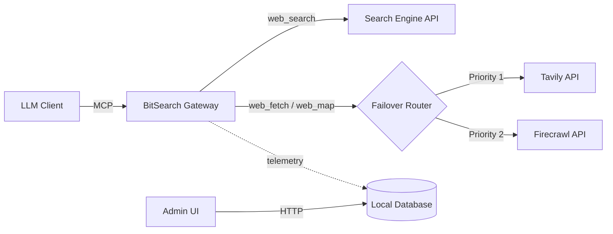
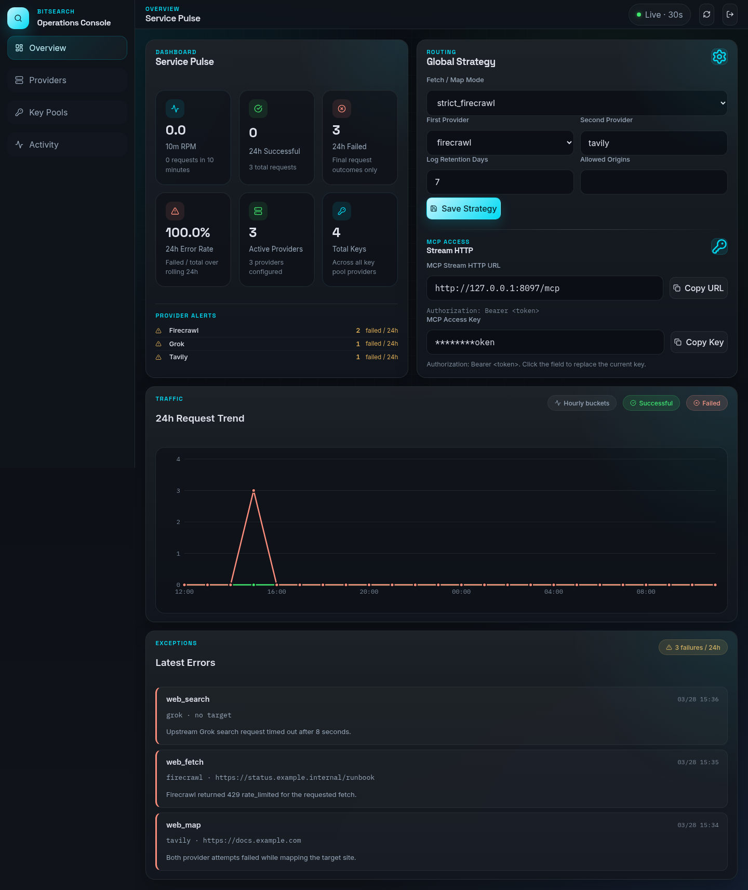
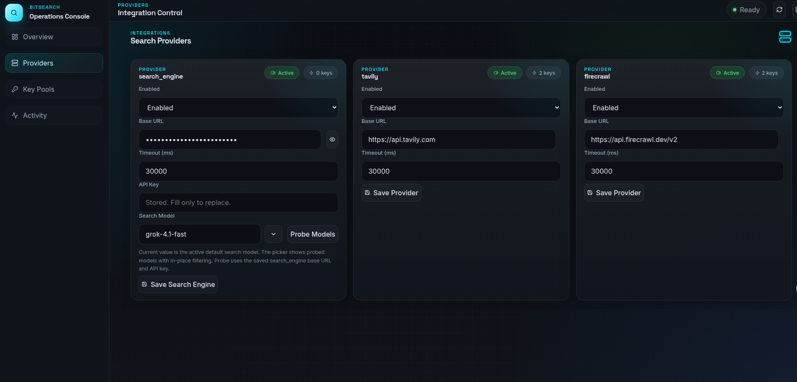
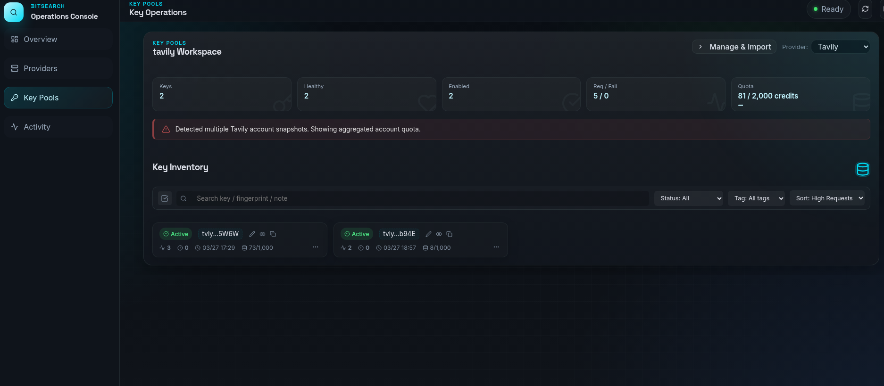
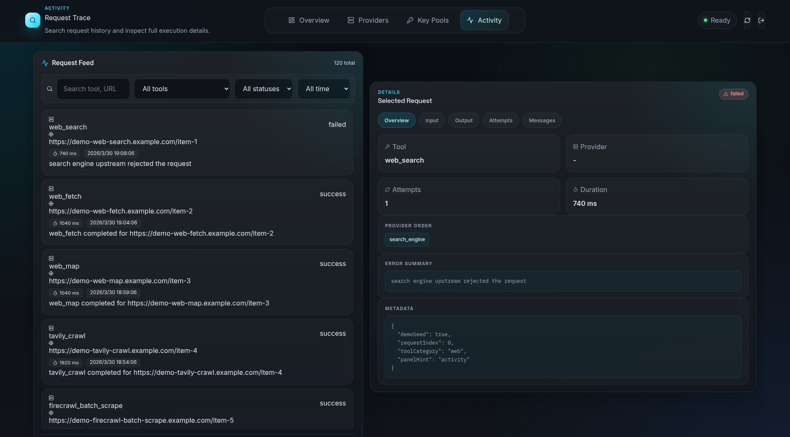

# BitSearch

Self-hosted MCP search gateway and admin console for personal use, with controllable web retrieval, key-pool failover, and observable search traffic.

<p>
  <a href="LICENSE"></a>
  <a href="https://www.typescriptlang.org/"></a>
  <a href="https://nodejs.org/"></a>
  <a href="Dockerfile"></a>
  <a href="https://github.com/Hedeoer/bitsearch/actions/workflows/docker-publish.yml"></a>
  <a href="https://hub.docker.com/r/hedeoerwang/bitsearch"></a>
  <a href="https://github.com/Hedeoer/bitsearch"></a>
</p>

## About

BitSearch packages two things into one deployable service: an HTTP-based Model Context Protocol server and a browser-based admin console. It is designed for individual users who want a single, self-hosted entrypoint for web search, fetch, and site-mapping workflows without giving up control over provider credentials, routing order, or request visibility.

The backend exposes `13` MCP tools over streamable HTTP, routes fetch-like operations across Tavily and Firecrawl key pools, and persists telemetry in SQLite. The frontend gives a single user one workspace for provider configuration, key imports, quota sync, MCP access details, dashboards, and request activity inspection. BitSearch does not implement team-facing collaboration or multi-user workspace features.

Project endpoints:

- GitHub: `https://github.com/Hedeoer/bitsearch`
- Docker Hub image: `docker.io/hedeoerwang/bitsearch`

### Highlights

- Exposes `13` MCP tools across search, configuration, and planning workflows.
- Supports multi-provider routing with ordered failover for Tavily and Firecrawl operations.
- Manages provider key pools with bulk import, enable/disable controls, testing, notes, quota sync, and CSV export.
- Includes a six-phase query planning engine for structured search execution.
- Tracks request logs, per-attempt failures, dashboard metrics, and recent errors in a built-in admin console.
- Supports two deployment paths: npm-based source deployment and Docker container deployment.

### Architecture



### MCP Tools Reference

BitSearch exposes 13 tools to the LLM client, covering three main areas:

#### 1. Search & Web Access
- **`web_search`**: Performs AI-driven web search using the configured search engine model. Caches sources server-side.
- **`get_sources`**: Retrieves source links cached during a `web_search` call using the returned `session_id`.
- **`web_fetch`**: Extracts full Markdown content from a target URL. Automatically fails over across Tavily and Firecrawl key pools.
- **`web_map`**: Maps website structure and discovers URLs using Tavily Map or Firecrawl.

#### 2. Planning Engine
A scaffold for LLMs to generate structured search strategies for highly complex tasks:
- **`plan_intent`**: Phase 1 - Analyze user intent and ambiguities.
- **`plan_complexity`**: Phase 2 - Assess if the task requires simple or multi-level planning.
- **`plan_sub_query`**: Phase 3 - Break down the task into sub-queries.
- **`plan_search_term`**: Phase 4 - Devise targeted search terms.
- **`plan_tool_mapping`**: Phase 5 - Map sub-queries to specific web tools.
- **`plan_execution`**: Phase 6 - Determine parallel vs. sequential execution.

#### 3. System Management
- **`get_config_info`**: Retrieves current server settings, key pool status, and tests search engine connectivity.
- **`switch_model`**: Toggles the default AI model used for `web_search`.
- **`toggle_builtin_tools`**: Indicates status of local client tool overriding (primarily for local Claude Code setups).

### Project Structure

```text
src/
├── server/
│   ├── db/              # SQLite database schema and instantiation
│   ├── http/            # Express admin routes, session, and middleware
│   ├── lib/             # Crypto, auth, HTTP helpers, admin session store
│   ├── mcp/             # MCP SDK tool registrations and input schemas
│   ├── providers/       # Fetch adapters (Tavily, Firecrawl, Search Engine)
│   ├── repos/           # Database repositories (logs, keys, queries)
│   ├── services/        # Core logic (Planning Engine, access controllers)
│   ├── app-context.ts   # AppContext interface shared across server modules
│   ├── main.ts          # Service entry point
│   ├── app.ts           # Express app layout
│   └── bootstrap.ts     # Runtime environment validation
├── shared/
│   └── contracts.ts     # Zod schemas and API payloads shared via ESM
└── web/
    ├── components/      # React components (Dashboard, Key Pools, Activity)
    ├── pages/           # Main workspace layouts
    ├── api.ts           # Frontend fetch client
    ├── format.ts        # Display formatting utilities
    ├── types.ts         # Frontend type definitions
    ├── toast-store.ts   # Toast notification state
    ├── LoginView.tsx    # Admin login page
    ├── theme.css        # Design tokens and theme system
    ├── styles.css       # Global and component styles
    └── main.tsx         # React UI entry point
```

## Built With

- [TypeScript](https://www.typescriptlang.org/)
- [Node.js](https://nodejs.org/)
- [Express](https://expressjs.com/)
- [React](https://react.dev/)
- [Vite](https://vitejs.dev/)
- [Zod](https://zod.dev/)
- [Model Context Protocol SDK](https://github.com/modelcontextprotocol/typescript-sdk)
- SQLite (`node:sqlite`)
- Docker and Docker Compose

## Getting Started

### Prerequisites

| Mode | Requirement |
|------|-------------|
| npm deployment | Node.js `22+`, npm `10+` |
| Docker deployment | Docker `24+`, Docker Compose v2 |

### Installation

Shell examples below use `bash`. A PowerShell alternative is shown where the command differs.

1. Clone the repository and install dependencies.

```bash
git clone https://github.com/Hedeoer/bitsearch.git
cd bitsearch
npm ci
```

2. Copy the example environment file.

```bash
cp .env.example .env
```

```powershell
Copy-Item .env.example .env
```

3. Fill in the required production values.

At minimum, set these before any production deployment:

- `APP_ENCRYPTION_KEY`
- `ADMIN_AUTH_KEY`
- `SESSION_SECRET`
- `MCP_BEARER_TOKEN`

4. Generate random secrets when needed.

```bash
node -e "console.log(require('crypto').randomBytes(32).toString('hex'))"
```

5. If you plan to use npm deployment, create the local data directory.

```bash
mkdir -p data
```

```powershell
New-Item -ItemType Directory -Force data | Out-Null
```

> Docker Compose reads `.env` automatically. npm deployment does not; export the variables from `.env` into your shell before starting the server.

### Quick Start

#### Option 1: npm deployment

```bash
npm run build
set -a
source .env
set +a
bash scripts/start.sh
```

This starts the production server from local source and serves the built admin UI from the same process.

#### Option 2: Docker deployment

Docker deployment uses these files:

| File | Used for | Notes |
|------|----------|-------|
| `.env` | Runtime configuration | Copy from `.env.example` and fill in the required values |
| `docker-compose.yml` | Build and run from local source | Uses the local `Dockerfile` |
| `docker-compose.image.yml` | Run a published image | Pulls `BITSEARCH_IMAGE` directly from Docker Hub |
| `docker-compose.prod.yml` | Optional production hardening | Adds restart policy, resource limits, and log rotation |

Container runtime variables:

| Variable | Required | Default / Example | Purpose |
|----------|----------|-------------------|---------|
| `APP_PORT` | No | `8097` | Container port exposed on the host |
| `APP_HOST` | No | `0.0.0.0` | Bind address inside the container |
| `TRUST_PROXY` | No | `false` | Set to `true` when running behind Nginx, Caddy, Traefik, or another reverse proxy |
| `DATABASE_PATH` | No | `/app/data/bitsearch.db` | SQLite file path inside the container; compose already points it to the mounted volume |
| `APP_ENCRYPTION_KEY` | Yes | random 32-byte hex string | Encrypts stored provider credentials |
| `ADMIN_AUTH_KEY` | Yes | custom bearer token | Used to access the admin API and sign in to the admin console |
| `SESSION_SECRET` | Yes | random 32-byte hex string | Signs the admin session cookie |
| `MCP_BEARER_TOKEN` | Yes | custom bearer token | Required by MCP clients calling `/mcp` |
| `BITSEARCH_IMAGE` | Only for published-image mode | `docker.io/hedeoerwang/bitsearch:latest` | Image reference used by `docker-compose.image.yml` |
| `NODE_ENV` | No | `production` | Already set by the compose files; normally no manual change is needed |

Path A: build and run the image from local source:

```bash
cp .env.example .env
# edit .env
docker compose up -d --build
```

Path B: run the already published Docker Hub image:

```bash
cp .env.example .env
# edit .env
export BITSEARCH_IMAGE=docker.io/hedeoerwang/bitsearch:latest
docker compose -f docker-compose.image.yml up -d
```

Common Docker commands:

```bash
docker compose logs -f
docker compose down
docker compose -f docker-compose.image.yml pull
docker compose -f docker-compose.image.yml up -d
docker compose -f docker-compose.image.yml -f docker-compose.prod.yml up -d
```

The GitHub Actions Docker publish workflow pushes:

- `latest` and `main` on successful pushes to `main`
- `sha-*` tags for traceability
- semantic version tags when you push tags matching `v*.*.*`

#### Option 3: Development mode
For local development, run the Vite frontend and TSX backend concurrently:
```bash
# Starts the Express server via tsx and the Vite dev server
npm run dev
```
- Admin Console: `http://localhost:5173`
- Backend API/MCP: `http://localhost:8097`

Useful endpoints after either deployment mode starts:

- App and admin console: `http://127.0.0.1:8097`
- Health check: `http://127.0.0.1:8097/healthz`
- MCP endpoint: `http://127.0.0.1:8097/mcp`

For full deployment options, see [DEPLOYMENT.md](DEPLOYMENT.md).

## Usage

### 1. Verify the service is running

```bash
curl http://127.0.0.1:8097/healthz
```

Expected response:

```json
{"ok":true}
```

### 2. Connect an MCP client

Example streamable HTTP client configuration. The exact field names vary by client, but the endpoint and bearer token are the important parts:

```json
{
  "mcpServers": {
    "bitsearch": {
      "type": "streamable-http",
      "url": "http://127.0.0.1:8097/mcp",
      "headers": {
        "Authorization": "Bearer <MCP_BEARER_TOKEN>"
      }
    }
  }
}
```

### 3. Operate the admin console

1. Start the app with one of the deployment modes above.
2. Open `http://127.0.0.1:8097`.
3. Sign in with `ADMIN_AUTH_KEY`.
4. Configure provider base URLs, import Tavily / Firecrawl keys, and review the MCP access panel.
5. Use the Overview, Providers, Keys, and Activity workspaces to monitor routing behavior and failures.

### 4. Configure providers

#### search_engine (OpenAI-compatible endpoint)

`search_engine` is the core search provider. Point it at any OpenAI-compatible chat completions service.

In the **Providers** workspace, set:

- **Base URL** — the root of the OpenAI-compatible API, e.g.:
  - OpenAI: `https://api.openai.com/v1`
  - Ollama (local): `http://localhost:11434/v1`
  - Any third-party relay: follow the provider's documentation
- **API Key** — the API key for the service (stored encrypted, never logged)
- **Model** — the model ID to use for search; can also be switched at runtime via the `switch_model` MCP tool
- **Timeout** — set to ≥ 120 000 ms; search completions take longer than regular chat requests

#### Tavily (key pool)

Tavily supplies extra sources for `web_search` and handles `web_fetch` / `web_map` requests.

1. Get a key at <https://tavily.com> — the free tier includes 1 000 API calls/month.
2. Open the **Keys** workspace, select **Tavily**, paste one or more keys (one per line), and click **Import**.
3. Keys are deduplicated automatically. View health status and quota in the same workspace.
4. Base URL default: `https://api.tavily.com` — leave unchanged unless you use a proxy.

#### Firecrawl (key pool)

Firecrawl handles `web_fetch` (page scrape → Markdown), `web_map` (site URL graph), and `web_search` extra sources (search results supplement).

1. Get a key at <https://www.firecrawl.dev> — the free tier includes 500 credits/month.
2. Open the **Keys** workspace, select **Firecrawl**, paste the key, and click **Import**.
3. Base URL default: `https://api.firecrawl.dev/v1` — leave unchanged unless you use a proxy.

#### Fetch mode (routing strategy)

Set in the **Providers** workspace under **Fetch Mode**:

| Mode | Behavior |
|------|----------|
| `auto_ordered` (recommended) | Tries Tavily first; falls back to Firecrawl on failure or quota exhaustion |
| `strict_tavily` | Uses Tavily only; fails if no Tavily keys are available |
| `strict_firecrawl` | Uses Firecrawl only; fails if no Firecrawl keys are available |

### Screenshots









## FAQ & Troubleshooting

- **Q: MCP connection times out / fails?**
  A: Ensure `TRUST_PROXY=true` in your `.env` if exposing behind an NGinX/Caddy reverse proxy, and make sure `MCP_BEARER_TOKEN` matches your client config.
- **Q: What happens when Tavily keys run out of quota?**
  A: The Failover Router will mark the exhausted key as invalid for a timeout period and rotate to the next active Tavily key. If no Tavily keys remain, it gracefully downgrades to Firecrawl.
- **Q: I lost my `APP_ENCRYPTION_KEY`. Can I recover my API keys?**
  A: No. Keys are securely stored in SQLite using AES-256-GCM. If you lose the encryption key, you cannot decrypt the payload and must truncate the database to re-import keys.

## Acknowledgments

This project is heavily inspired by [GrokSearch](https://github.com/GuDaStudio/GrokSearch) by GuDaStudio. BitSearch builds upon their AI-search + scraping fallback architecture, adding an Admin Console and Key Pooling capabilities.

## Roadmap

- Add more provider adapters and per-tool routing policies.
- Increase automated coverage for MCP transport, failover logic, and admin flows.
- Add release notes and documented image version channels for Docker Hub consumers.
- Expand dashboard analytics and operational audit views.

## Contributing

See [CONTRIBUTING.md](CONTRIBUTING.md) for issue reporting, pull request flow, coding standards, and verification requirements.

## License

Distributed under the MIT License. See [LICENSE](LICENSE) for the full text.
